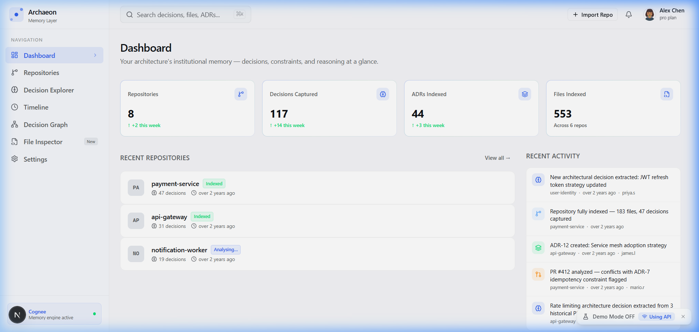
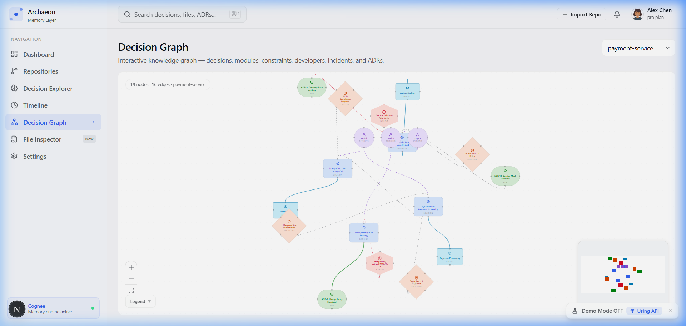
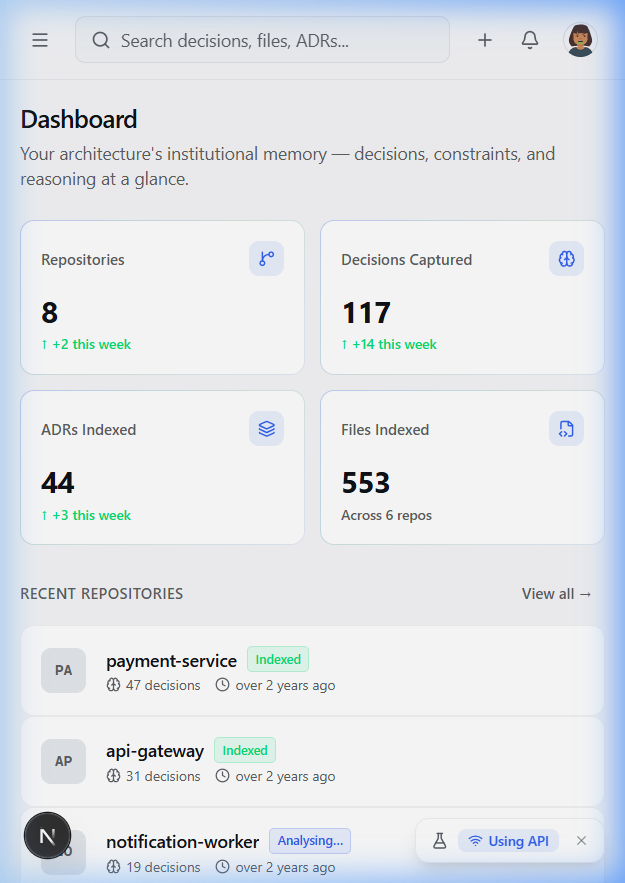
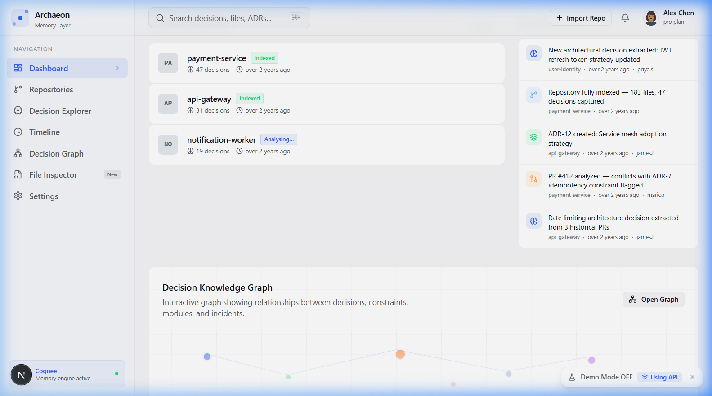

<p align="center">
  
  
  
</p>

<h1 align="center">🏛️ Archaeon</h1>
<h3 align="center"><em>The Institutional Memory Layer for Software Architecture</em></h3>

<p align="center">
  Know not just <strong>what</strong> your code does, but <strong>why</strong> every decision was made,<br/>
  by whom, under what constraints, and how it evolved.
</p>

---

## 📌 The Problem

Engineers inherit codebases with **zero decision context**. They re-examine choices already made, break invariants they didn't know existed, and repeat the same architectural debates because the reasoning that produced the current structure was never persisted. When a senior engineer leaves, their mental model of the system walks out with them.

Traditional tooling — wikis, comments, PRs — is brittle, disconnected, and dies the moment it becomes stale. This isn't a documentation problem. **The unsolved problem is persisting _why_**, including the alternatives considered and rejected.

## 💡 The Solution

Archaeon automatically ingests git history, PR descriptions, and ADRs from any GitHub repository, uses AI to extract structured architectural decisions, and stores them in a **traversable knowledge graph** powered by [Cognee](https://github.com/topoteretes/cognee) and Neo4j.

**Core workflow:**

```
Import Repository → Build Memory Graph → Open File → Instantly See "Why This Exists"
                                        → Open PR  → Receive Architecture-Aware Suggestions
```

---

## ✨ Key Features

| Feature | Description |
|---|---|
| **Decision Explorer** | Search, filter, and expand every architectural decision — by author, module, status, type, or tag |
| **Architecture Timeline** | Chronological view of how the system evolved, year by year |
| **Knowledge Graph** | Interactive React Flow visualization of decision ↔ module ↔ constraint ↔ author relationships |
| **File Inspector** | Select any file and instantly see *why it exists*, who authored its design, and what alternatives were rejected |
| **AI Decision Extraction** | GPT-powered pipeline extracts structured `ArchitectureDecision` objects from commits, PRs, and ADRs |
| **Cognee Memory Primitives** | `remember()` · `recall()` · `improve()` · `forget()` — a living, evolving knowledge graph, not static documentation |
| **GitHub Webhooks** | Continuous memory updates as new PRs merge and ADRs are written |
| **Demo Mode** | One-click toggle to showcase the product with known-good mock data — no backend dependency during demos |

---

## 🏗️ Architecture

```
┌─────────────────────────────────────────────────────────────────────┐
│                        archaeon-web (Next.js)                       │
│         Dashboard · Decision Explorer · Graph · Timeline            │
└──────────────────────────────┬──────────────────────────────────────┘
                               │  HTTPS + JSON / JWT
                               ▼
┌─────────────────────────────────────────────────────────────────────┐
│                 archaeon-backend (Django + DRF + Celery)             │
│     Auth · Workspaces · Repositories · Graph · Memory · Analytics   │
│                    ┌─────────┬────────────┐                         │
│                    │ Postgres│  Neo4j     │                         │
│                    │ (data)  │  (graph)   │                         │
│                    └─────────┴────────────┘                         │
│                         │  Cognee SDK  │                            │
└──────────────────────────────┬──────────────────────────────────────┘
                               │  HTTPS + REST / Internal API Key
                               ▼
┌─────────────────────────────────────────────────────────────────────┐
│          repository-intelligence-service (NestJS)                    │
│  GitHub Client · Fetcher · Normalizer · AI Extraction · Validation  │
│  Pipeline Orchestrator · Webhook Processor                          │
│                    ┌─────────┬────────────┐                         │
│                    │ GitHub  │  OpenAI    │                         │
│                    │  API    │  (GPT)     │                         │
│                    └─────────┴────────────┘                         │
└─────────────────────────────────────────────────────────────────────┘
```

### Service Responsibilities

| Service | Tech Stack | Responsibility |
|---|---|---|
| **archaeon-web** | Next.js 16, React 19, TypeScript, Tailwind CSS v4, shadcn/ui, React Flow, Framer Motion | Frontend — everything the user sees and interacts with |
| **archaeon-backend** | Django 5, DRF, Celery, PostgreSQL 16, Redis 7, Neo4j 5.18, Cognee, drf-spectacular | API gateway, auth, persistence, memory operations, graph queries |
| **archaeon-ingestion** | NestJS 11, TypeScript, LangChain, Octokit, Pino | GitHub data fetching, AI-powered decision extraction, webhook processing |

---

## 📁 Project Structure

```
Archaeon-Hackathon/
├── apps/
│   ├── frontend/                    # Documentation & planning
│   │   └── archaeon/               # Next.js 16 web application
│   │       ├── src/
│   │       │   ├── app/
│   │       │   │   ├── (app)/      # Authenticated routes
│   │       │   │   │   ├── dashboard/
│   │       │   │   │   ├── decisions/
│   │       │   │   │   ├── graph/
│   │       │   │   │   ├── timeline/
│   │       │   │   │   ├── repositories/
│   │       │   │   │   ├── files/
│   │       │   │   │   └── settings/
│   │       │   │   ├── auth/
│   │       │   │   ├── landing/
│   │       │   │   └── sign-in/
│   │       │   ├── components/     # Reusable UI components
│   │       │   └── lib/            # API client, types, mock data
│   │       └── screenshots/        # UI screenshots
│   │
│   ├── backend/                    # Django backend
│   │   ├── apps/
│   │   │   ├── authentication/     # JWT + GitHub OAuth
│   │   │   ├── workspaces/         # Multi-workspace support
│   │   │   ├── repositories/       # Repository management
│   │   │   ├── graph/              # Knowledge graph queries
│   │   │   ├── memory/             # Cognee memory operations
│   │   │   ├── orchestration/      # Job orchestration
│   │   │   ├── analytics/          # Dashboard statistics
│   │   │   ├── notifications/      # Event notifications
│   │   │   └── common/             # Health checks, shared utilities
│   │   ├── config/                 # Django settings, Celery, ASGI/WSGI
│   │   ├── requirements/           # Python dependencies (base/dev/prod)
│   │   ├── tests/
│   │   └── docker-compose.yml      # Full stack: Postgres, Redis, Neo4j
│   │
│   └── archaeon-ingestion/         # NestJS intelligence service
│       └── src/
│           └── modules/
│               ├── github-client/      # GitHub App auth & API client
│               ├── repository-fetcher/ # Commits, PRs, files, branches
│               ├── normalizer/         # Raw data → internal schema
│               ├── ai-extraction/      # LangChain + OpenAI structured output
│               ├── validation/         # Confidence scoring, dedup, quality filters
│               ├── pipeline/           # Orchestrates the full extraction flow
│               ├── webhook-processor/  # GitHub event processing
│               ├── api/                # REST endpoints (Django-facing)
│               ├── backend-client/     # Client for callback to Django
│               ├── health/             # Health check endpoint
│               └── workspace/          # Ephemeral per-job workspace
```

---

## 🚀 Getting Started

### Prerequisites

- **Node.js** ≥ 20 and **pnpm** (ingestion service) / **npm** (frontend)
- **Python** 3.13+ and **pip**
- **Docker** and **Docker Compose**
- A **GitHub** account (for OAuth)
- An **OpenAI** API key

### 1. Clone the Repository

```bash
git clone https://github.com/your-org/Archaeon-Hackathon.git
cd Archaeon-Hackathon
```

### 2. Start Infrastructure (PostgreSQL, Redis, Neo4j)

```bash
cd apps/backend
cp .env.example .env        # Edit with your secrets
docker compose up -d postgres redis neo4j
```

### 3. Set Up the Backend (Django)

```bash
cd apps/backend
python -m venv .venv && source .venv/bin/activate
pip install -r requirements/development.txt
python manage.py migrate
python manage.py createsuperuser
python manage.py runserver    # → http://localhost:8000
```

Start Celery workers (separate terminals):

```bash
celery -A config worker --loglevel=info
celery -A config beat --loglevel=info
```

### 4. Set Up the Ingestion Service (NestJS)

```bash
cd apps/archaeon-ingestion
cp .env.example .env         # Edit with your secrets
pnpm install
pnpm run start:dev           # → http://localhost:8081
```

### 5. Set Up the Frontend (Next.js)

```bash
cd apps/frontend/archaeon
npm install
```

Create `.env.local`:

```env
NEXT_PUBLIC_API_URL=http://localhost:8000
NEXT_PUBLIC_DEMO_MODE=false
```

```bash
npm run dev                  # → http://localhost:3000
```

> **💡 Demo Mode:** Set `NEXT_PUBLIC_DEMO_MODE=true` to run the frontend with mock data — no backend required.

---

## 🔧 Environment Variables

### Backend (`apps/backend/.env`)

| Variable | Description | Default |
|---|---|---|
| `DJANGO_SECRET_KEY` | Django secret key | *(required)* |
| `DEBUG` | Enable debug mode | `True` |
| `DATABASE_NAME` | PostgreSQL database name | `archaeon` |
| `DATABASE_USER` | PostgreSQL user | `postgres` |
| `DATABASE_PASSWORD` | PostgreSQL password | `postgres` |
| `REDIS_URL` | Redis connection URL | `redis://localhost:6379/0` |
| `CELERY_BROKER_URL` | Celery broker URL | `redis://localhost:6379/1` |
| `JWT_SECRET` | JWT signing secret | *(required)* |
| `GITHUB_CLIENT_ID` | GitHub OAuth app client ID | *(required)* |
| `GITHUB_CLIENT_SECRET` | GitHub OAuth app secret | *(required)* |
| `OPENAI_API_KEY` | OpenAI API key | *(required)* |
| `COGNEE_API_KEY` | Cognee API key | *(required)* |
| `NEO4J_URI` | Neo4j connection URI | `bolt://localhost:7687` |
| `NEO4J_USERNAME` | Neo4j username | `neo4j` |
| `NEO4J_PASSWORD` | Neo4j password | `password` |
| `INTERNAL_API_KEY` | Key for backend ↔ ingestion auth | *(required)* |

### Ingestion Service (`apps/archaeon-ingestion/.env`)

| Variable | Description | Default |
|---|---|---|
| `PORT` | Service port | `8081` |
| `ARCHAEON_BACKEND_URL` | Django backend URL | `http://backend:8000` |
| `INTERNAL_API_KEY` | Shared internal API key | *(required)* |

### Frontend (`apps/frontend/archaeon/.env.local`)

| Variable | Description | Default |
|---|---|---|
| `NEXT_PUBLIC_API_URL` | Django backend URL | `http://localhost:8000` |
| `NEXT_PUBLIC_DEMO_MODE` | Force mock data mode | `false` |

---

## 🐳 Docker Deployment

Run the **entire stack** with Docker Compose:

```bash
cd apps/backend
docker compose up --build
```

This starts all services:

| Container | Port | Description |
|---|---|---|
| `archaeon_postgres` | `5432` | PostgreSQL 16 database |
| `archaeon_redis` | `6379` | Redis 7 cache & broker |
| `archaeon_neo4j` | `7474` / `7687` | Neo4j graph database (Browser / Bolt) |
| `archaeon_backend` | `8000` | Django API server (Gunicorn) |
| `archaeon_celery_worker` | — | Celery task worker |
| `archaeon_celery_beat` | — | Celery periodic scheduler |

---

## 📡 API Overview

### Public API (Frontend → Django, JWT-authenticated)

| Endpoint | Method | Description |
|---|---|---|
| `/api/auth/token/` | `POST` | Obtain JWT access + refresh tokens |
| `/api/auth/me/` | `GET` | Current authenticated user |
| `/api/repositories/` | `GET` | List all repositories |
| `/api/repositories/:id/` | `GET` | Repository details |
| `/api/repositories/:id/job/` | `GET` | Repository analysis job status |
| `/api/decisions/` | `GET` | List decisions (filterable: `?q=`, `?author=`, `?module=`, `?type=`, `?status=`, `?tag=`) |
| `/api/timeline/` | `GET` | Architecture timeline events |
| `/api/dashboard/stats/` | `GET` | Dashboard statistics |
| `/api/graph/?repo=:id` | `GET` | Knowledge graph nodes + edges |
| `/api/files/context/?repo=:id&path=:path` | `GET` | File context — "why this file exists" |

### Internal API (Django → Ingestion Service, API key-authenticated)

| Endpoint | Method | Trigger |
|---|---|---|
| `/internal/v1/analyze` | `POST` | New repository import (full pipeline) |
| `/internal/v1/webhook` | `POST` | GitHub webhook event (incremental) |

📖 **Interactive API docs:** `http://localhost:8000/api/docs/` (Swagger) or `http://localhost:8000/api/redoc/` (ReDoc)

---

## 🧠 Cognee Integration — Why It's Essential

Archaeon uses all four of Cognee's memory primitives as the core product differentiator:

| Primitive | When | What |
|---|---|---|
| **`remember()`** | New PR merged, new ADR, new decision | Store structured decision with reason, constraints, alternatives, module, files, author, timestamp |
| **`recall()`** | Developer opens a file, opens a PR, searches | Retrieve *why this exists*, past discussions, rejected alternatives, related constraints |
| **`improve()`** | New information arrives, constraint changed | Update existing decisions — memory becomes smarter, no duplicates |
| **`forget()`** | Decision superseded | Archive + link to the new decision — history remains intact |

> **Without Cognee, this degrades to RAG search.** Cognee's graph layer enables traversable relationships: *this file depends on this service because of this constraint introduced at this time by this team.* That's a knowledge graph, not a flat embedding.

---

## 🧪 Testing

### Backend

```bash
cd apps/backend
pytest                      # Run all tests
pytest --cov                # With coverage report
```

### Ingestion Service

```bash
cd apps/archaeon-ingestion
pnpm test                   # Unit tests (Jest)
pnpm test:cov               # With coverage
pnpm test:e2e               # End-to-end tests
```

### Frontend

```bash
cd apps/frontend/archaeon
npm run lint                # ESLint
```

---

## 🖼️ Screenshots

<table>
  <tr>
    <td><strong>Dashboard</strong></td>
    <td><strong>Decision Graph</strong></td>
  </tr>
  <tr>
    <td></td>
    <td></td>
  </tr>
  <tr>
    <td><strong>Mobile Dashboard</strong></td>
    <td><strong>Demo Mode</strong></td>
  </tr>
  <tr>
    <td></td>
    <td></td>
  </tr>
</table>

---

## 👥 Team

| Member | Role | Ownership |
|---|---|---|
| **Member 1** | Frontend & Demo Experience | Next.js web app, UI/UX, graph visualization, demo mode, responsive design |
| **Member 2** | Cognee & Memory Engineer | Django backend, Cognee integration, Neo4j, memory APIs, graph queries |
| **Member 3** | AI & GitHub Pipeline | NestJS ingestion service, GitHub integration, AI extraction, webhooks |

---

## 🔑 What Makes Archaeon Different

| Tool | What It Does | What It Lacks |
|---|---|---|
| **ChatGPT / Claude** | Generate rationale | Hallucinated — no grounding in your actual history |
| **Cursor** | Write code | No institutional memory across time |
| **GitHub Copilot** | Autocomplete | No concept of a decision that was made |
| **Swimm / Confluence** | Document things | No traversable reasoning chains |
| **Archaeon** | **Persistent, traversable architectural reasoning graph** | — |

> *Archaeon is the first tool that treats architectural reasoning as a first-class persistent data structure.*

---

## 📄 License

This project was built for the **Cognee Hackathon**. License: UNLICENSED.

---

<p align="center">
  <strong>Built with 🧠 Cognee · 🔗 Neo4j · 🐍 Django · ⚡ NestJS · ⚛️ Next.js</strong>
</p>
